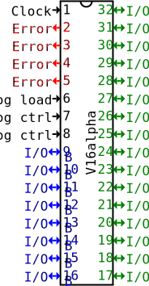

V16α processor (V16alpha)
=========================

The V16alpha is a general-purpose 16 bit processor that lacks all the
features you would wish, and has all sorts of things you wish it didn't.

It most notably has an internal program memory (for up to 256 instructions),
allowing the full use of its 24 I/O pins ; instructions can still be fetched,
of course, so it can be used as a manually managed-cache or a way for the
processor to be used without necessitating an external memory.


### Facilities

The following registers are provided :

 - `RINT` (internal), general purpose, used for arithmetic (16 bits)
 - `RIOA` (input/output), supposed to be connected to a bus (16 bits)
   `RIOA` is also used for program loading.
 - `RIOB` (input/output), supposed to be connected to a bus (8 bits)
 - `RINO` redirects to RIOA
 
In addition, other registers are used for operation of mostly automatic
components :
 
 - `RERR` (error), set by the processor during operation (4 bits)
 - `RCNT` (counter), pointing to the current instructions (8 bits)
 - `RSTA` (stack), pointing to the current stack level (4 bits)

`RCNT` and `RSTA` work the same way, in that they both address a memory
unit. On the V16alpha, "memory units" are arrays of data that cannot be
used directly by programs. They use specialized operations instead.

`RCNT` addresses instructions, which are 3 bytes long (operator, 
operand 1, operand 2). If the operands are not present, they are
replaced with `0xFF` padding. `RCNT` is thus addressing 768 bytes
(256 instructions). The data unit it addresses is filled with ones
(`0xFF`) at initialization. You may also use `DLPR` to load data from
the unit into a register, and `DSPR` to store data into the unit.
Note that these instructions address the unit byte per byte, unlike
`RCNT` !

The stack addressed by `RSTA` is a memory unit of 256 bits, which is
split in thirty-two 8-bits values. It can be addressed randomly, but
supports stack operations and is referred to as the stack. The data
unit it addresses is filled with zeroes (`0x00`) at initialization.
You can use `POP` and `PUSH` for automatic operation, or `DLST` and
`DSST` for loading/storing into the unit.

### Pinout



(Alimentation/Ground pins not represented)

| No  | Name    | Description                                                  |
|-----|---------|--------------------------------------------------------------|
| 1   |Clock    | Front (1) triggers cycle (processor resets it to 0)          |
|2-5  |Error    | Exposes the status code (read only)                          |
|6    |Prog load| Order the loading of an instruction                          |
|7-8  |P offset | Control where a loaded instruction is set                    |
|9-16 | I/O B   | Read/write the processor's I/O B register                    |
|17-32| I/O A   | R/W the processor's I/O A register, load programs            |

Important : Pins are numbered 1-32 here, but they might be 0-indexed in some
applications, so remember to check.

```
// pinset description
// (see tools.richeli.eu/pinout)
# title
V16alpha
# top ; mark
# end

< Clock
# red
4x > Error
# end
1x < Prog load
2x < P offset
# blue
8x <> I/O_B
# green
16x <> I/O_A
```


### Assembly

Assembly for the V16alpha is a list of commands of the form :

`<OP> [target or value] [target or value]`

Values are in decimal, hexadecimal (prefixed with `0x`), or binary (`0b`),
from 0 to 159 (`0x9F`). Unless specifically stated, it is not possible to use
literals over `9F`, as these values are reserved.

Text beginning with `#` is a comment, and not parsed.

Operations :

|  OP   | operand 1 | operand 2 | Description                           | Cost |
|-------|-----------|-----------|---------------------------------------|------|
| STORE | value/reg | reg       | Store op1 in op2                      | 2    |
| DLPR  | value/reg | reg       | Load program[op1] to op2              | 3    |
| DSPR  | value/reg | value/reg | Store op1 to program[op2]             | 3    |
| DLST  | value/reg | reg       | Load stack[op1] to op2                | 3    |
| DSST  | value/reg | value/reg | Store op1 to stack[op2]               | 3    |
| PUSH  | value/reg |           | Push a value onto the stack           | 2    |
| POP   | reg       |           | Pop the topmost value                 | 2    |
| LABEL | value     |           | (skipped) set instr label             | 1    |
| JUMP  | value     |           | Jump to label of value [op1]          | 1+X  |
|       |           |           |                                       |      |
| ADD   | value/reg | value/reg | (op2) optional                        | 2    |
| REM   | value/reg | value/reg | (op2) optional                        | 2    |
| MUL   | value/reg | value/reg | (op2) optional                        | 3    |
| DIV   | value/reg | value/reg | (op2) optional ; result floored       | 3    |
| MODU  | value/reg | value/reg | (op2) optional                        | 2    |
| AND   | value/reg | value/reg | (op2) optional                        | 1    |
| OR    | value/reg | value/reg | (op2) optional                        | 1    |
| XOR   | value/reg | value/reg | (op2) optional                        | 1    |
|       |           |           |                                       |      |
| IFEQ  | value/reg | value/reg | execute following instr only if 1= 2  | 2    |
| IFLT  | value/reg | value/reg | execute following instr only if 1< 2  | 2    |
| IFLE  | value/reg | value/reg | execute following instr only if 1<=2  | 2    |
| IFGT  | value/reg | value/reg | execute following instr only if 1> 2  | 2    |
| IFGE  | value/reg | value/reg | execute following instr only if 1>=2  | 2    |
|       |           |           |                                       |      |
| END   |           |           | End execution                         | 1    |

Costs in number of cycles. When a register is specified instead of a
literal value, its value is used.

**Jumping :** The current behavior of the `JUMP` instruction is to set `RCNT` to
`0` and increment it until a label with the right value is found. Execution
time thus varies depending on instruction number of the label.

#### Conditionals

The provided tests (`IF`) execute the operation immediatly following only if
their condition is true. Essentially, all they do is increment the program
counter if the condition is false.

The official v16a assembler provides syntactic sugar for tests, with the more
intuitive symbols `=`, `>`, `>=`, `<`, and `<=`. Use the keyword `IF` for this,
and the expression will be translated. For instance, `IF RINT = 5` is the same
as `IF RINT EQ 5` which is the same as `IFEQ RINT 5` which translates to
`C0 D0 05`. Do take care to separate each symbol with whitespace.

#### Arithmetic operations

`ADD`, `REM`, `MUL`, `DIV`, and `MODU` all operate on `RINT` and can have
either one or two operands.

If they have one operand, then the value of `RINT` becomes
(the value of `RINT` `operation` `operand`).

If they have two operands, the value of `RINT` becomes
(`operand 1` `operation` `operand 2`).

Remember that, as usual, only literals up to `0x9F` are allowed.

Bitwise operations `AND`, `OR` and `XOR` work the same way.

**Tips and Tricks :** *XOR-ing a value with all 1's performs a negation.*

#### Assembler instructions

The assembler works in two passes : it first removes comments, strips code, and
interprets assembly instructions ; then, it goes through the code again, 
performing substitutions and generating machine code.

Assembler instructions start with a `:`.

`:CONST <name> <value>` defines the `<name>` constant to `<value>`. `<value>`
can be any valid word (literal, instruction, register..).

Then, the constant can be written in code prefixed by a `:`.
Unlike normal assembly, **constant names are case-sensitive**.

This example has a total length of 1 instruction in machine code, as the
constant definition and substitution is performed before generating the code.
```
:CONST Hello 100
PUSH :Hello
# yields code A5 64 FF
```

There is a special syntax for declaring a constant that takes as value the
number (0-indexed) of the instruction is precedes :
```
STORE :name RIOA # writes `2` to RIOA 
PUSH 100
:name: POP RINT
END
```
This special syntax creates an empty line after it (all `0xFF`) if there are no
instructions on the same line.


**Tips and Tricks :** *You may then use `STORE :name: RCNT` to write the value
to the program counter and jump there statically, although watch out: the
program counter will automatically increment after `STORE` finishes.*

### Machine code

Operators and operands are one byte each. Each instruction is three
bytes long, with `0xFF` used to pad instructions that have less than
two operands.

Operands up to `0x9F` are taken as values, as is.
(values above 159 thus cannot be represented directly in machine code,
and have to be computed)
Values from `0xA0` are reserved for keywords, up to `0xCF`.
Values from `0xD0` are reserved for data, up to `0xFE`.

Machine code/operator table :

|  OP   | Code |
|-------|------|
| STORE |`0xA0`|
| DLPR  |`0xA1`|
| DSPR  |`0xA2`|
| DLST  |`0xA3`|
| DSST  |`0xA4`|
| PUSH  |`0xA5`|
| POP   |`0xA6`|
| LABEL |`0xA7`|
| JUMP  |`0xA8`|
|       |      |
| ADD   |`0xB0`|
| REM   |`0xB1`|
| MUL   |`0xB2`|
| DIV   |`0xB3`|
| MODU  |`0xB4`|
| AND   |`0xB5`|
| OR    |`0xB6`|
| XOR   |`0xB7`|
|       |      |
| IFEQ  |`0xC0`|
| IFLT  |`0xC1`|
| IFLE  |`0xC2`|
| IFGT  |`0xC3`|
| IFGE  |`0xC4`|
|       |      |
| END   |`0xCF`|

In addition, `0xFF` serves as a 'skip this instruction' operator.

Codes for registers :

| Register | Code |
|----------|------|
| RINT     |`0xD0`|
| RERR     |`0xD1`|
| RINO     |`0xD2`|
| RCNT     |`0xD3`|
| RSTA     |`0xD4`|
| RIOA     |`0xD5`|
| RIOB     |`0xD6`|

#### A note on arithmetic instructions

Arithmetic instructions can have one or two operands in assembly. In machine
code, if the second operand is `0`, it's interpreted as being an operation on
the register itself.


### Loading a program

The V16alpha uses the I/O A register for loading instruction.

Remember that machine code instructions are three bytes long. The processor can
hold 256 three-bytes instructions.

To load an instruction :
 1. Set the first 8 pins of the I/O A bus to the index to put the instr at
 2. Set the last 8 pins of the same bus to the byte to write
 3. Set the `Prog ctrl` pins to what the byte is :
     1. (`00`) instruction
     2. (`01`) first operand
     3. (`10`) second operand 
 4. Set the `Prog load` pin to `1`

The processor checks these pins each time it finishes an instruction (code `4`).
The loading takes three cycles. The error code is set to `5` for the first cycle
of the loading, after which it is set to `2` (like for any instruction).

The `Prog load` and `Prog ctrl` pins are all set to `0` after reading.

### Running

Cycling the processor when `Prog load` is at `0` will execute instructions.

Operation ends either on fatal error (check `RERR`), on `END`
instruction, or when reaching the end of the program table
(both produce error code `9`).

Cycling when the error code is `9` (finished execution) will automatically
reset the program counter to 0 before continuing execution.

#### Resetting

Setting the `Prog load` and both `Prog ctrl` pins to 1 (checked when an
instruction is finished) will reset the program counter and the error code
to `0`. No further development happens that cycle.

Once the fifth consecutive cycle in that state is reached, the processor is
entirely reset (cycle count, pins, registers, stack, and program memory),
a process taking 1 cycle.

The `Prog load` and `Prog ctrl` pins are all set to `0` after reading. Do set
them back up to `1` for resetting.

### Status codes

Available by checking `RERR`, a 4-bit register. Codes :

| Code | Hex | Status                   |
|------|-----|--------------------------|
| 0    | 0   | Processor ready          |
| 1    | 1   | No program               |
| 2    | 2   | Executing                |
| 3    | 3   | Skipped an instruction   |
| 4    | 4   | Finished current instr   |
| 5    | 5   | Started loading instr    |
| 9    | 9   | Finished execution       |
|      |     |                          |
| 10   | A   | Invalid operation        |
| 11   | B   | Invalid operand          |
| 12   | C   | Wrong number of operands |
| 13   | D   | Arithmetic problem       |
|      |     |                          |
| 15   | F   | Other                    |